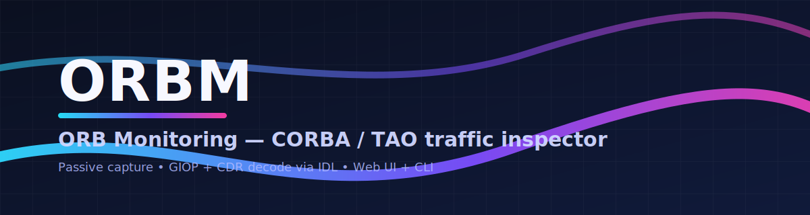
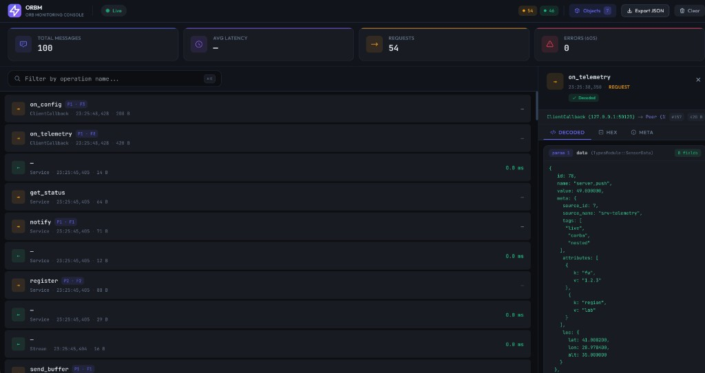

# ORB Monitoring (ORBM)

**ORBM** (ORB Monitoring) is a modern traffic inspector for CORBA / TAO systems.
It passively captures GIOP traffic from the network, decodes CDR payloads using
your IDL files, and presents them either:

- As a **web UI** (HTTP + WebSocket) for interactive inspection
- As a **CLI tool** for terminal-based monitoring

This repo contains the **C++ backend** (capture, decoding, APIs) and a
single-page **frontend** under `src/web/frontend`, which is served statically
by the backend in web mode.

---

## Features

- Live capture from a network interface using **libpcap**
- Transparent support for **TAO / ACE** GIOP 1.0–1.2
- IDL-aware decoding via a custom **IDL parser**
  - structs (including nested and cross-module types)
  - sequences, arrays, typedef chains
  - enums (shows symbolic names instead of raw ints)
  - unions (discriminator + active branch)
  - exceptions and out/inout parameters
- Mapping from **Naming Service** entries to object keys
- Request/Reply correlation with latency calculation
- Web API (`/api/messages`, `/api/objects`, `/ws`) for UI / tooling
- Two operation modes:
  - **Web UI mode** (default) – "Wireshark for CORBA" style GUI
  - **CLI mode** (`--cli`) – rich, colorized terminal output

---

## Build

From `cpp/`:

```bash
mkdir -p build
cd build
cmake ..
cmake --build .
```

This produces the executable:

- `./orbm` – main binary

### Dependencies

- C++17 compiler
- CMake >= 3.14
- libpcap
- ACE + TAO runtime (for `tao_nslist` / `tao_catior` and TAO-based apps)

External libraries are fetched automatically via CMake `FetchContent`:

- [asio](https://github.com/chriskohlhoff/asio) (standalone)
- [Crow](https://github.com/CrowCpp/Crow)
- [nlohmann/json](https://github.com/nlohmann/json)

Make sure `ACE_ROOT` and `LD_LIBRARY_PATH` are set when running:

```bash
export ACE_ROOT=/root/project_x/corba_Viewer/ACE_wrappers
export LD_LIBRARY_PATH="$ACE_ROOT/lib:${LD_LIBRARY_PATH}"
```

You will also need a TAO Naming Service and your CORBA apps running, as in the
example setup under `../cpp_test`.

---

## Usage

From `cpp/build` (recommended):

### Web UI mode (default)

```bash
./orbm \
  --ns-ref "corbaloc:iiop:localhost:4500/NameService" \
  --idl ../cpp_test/idl \
  --interface any \
  --ws-port 3000
```

Then open:

- `http://localhost:3000` – ORBM web UI
- `http://localhost:3000/api/messages` – raw JSON messages
- `http://localhost:3000/api/objects` – discovered Naming Service objects

Web UI (shown in figure below):



### CLI mode

```bash
./orbm \
  --cli \
  --ns-ref "corbaloc:iiop:localhost:4500/NameService" \
  --idl ../cpp_test/idl \
  --interface any
```

Optional flags:

- `--hex` – also show params hex in CLI output
- `--buffer <N>` – keep last N messages in memory (default 100)

### Common options

- `--ns-ref <ref>` – CORBA Naming Service corbaloc
- `--interface, -i <iface>` – capture interface (e.g. `any`, `eth0`, `lo`)
- `--ws-port, -p <port>` – HTTP/WebSocket port in web mode
- `--idl <path>` – IDL file or directory (repeatable)
- `-- <orb_args...>` – extra ORB options passed to TAO tools

---

## Architecture (cpp/src)

```text
src/
  core/        – shared types & threading primitives
  protocol/    – GIOP + CDR decoding
  idl/         – IDL parser & registry
  net/         – libpcap capture + Naming Service discovery
  web/         – Crow HTTP/WS server + REST API
  cli/         – terminal UI (CLI mode)
  main.cpp     – argument parsing, wiring, mode selection
```

- **core/types.h** – `GiopMessage`, enums, `SharedData`, `Channel`, `WsEvent` etc.
- **protocol/giop.cpp** – GIOP header/body parsing, request/reply offsets
- **protocol/cdr_decode.cpp** – CDR decoding using IDL registry
- **idl/idl_parser.cpp** – IDL tokenizer + registry (ops, structs, enums, unions,...)
- **net/capture.cpp** – pcap-based TCP reassembly + GIOP extraction
- **net/discovery.cpp** – `tao_nslist` / `tao_catior` integration
- **web/server.cpp** – `/`, `/api/*`, `/ws` endpoints
- **cli/cli.cpp** – colorized streaming of messages to stdout

---

## Naming & Branding

- Project / binary name: **ORB Monitoring** – `orbm`
- Short name / alias: **ORBM**

You can run both modes from the same binary; there is no separate CLI executable.

